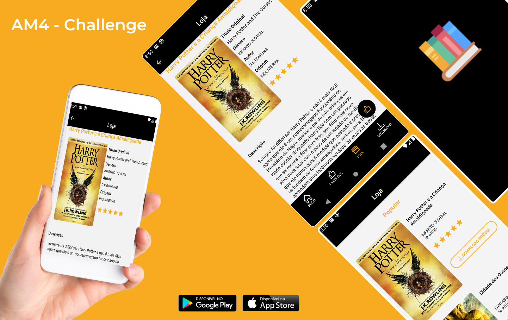

<h3 align="center" style="color: #f7ab21">
  AM4 - Challenge
</h3>

<h1 align="center">
  
</h1>

## :clapper: Preview

<h1 align="center" style="width: 200px">
  
</h1>

## :page_with_curl: About

**AM4 - Challenge** is an application to test knowledge for the position of Mobile developer with React native.

---

## :rocket: Technologies

- [React Native](https://reactnative.dev/)
- [React Navigation](https://reactnavigation.org/)
- [Styled Components](https://styled-components.com/)
- [Vector Icons](https://github.com/oblador/react-native-vector-icons)
- [Typescript](https://www.typescriptlang.org/)
- [SplashScreen](https://github.com/crazycodeboy/react-native-splash-screen)
---
## :file_folder: How to install

```bash

  # clone repository
  $ git clone https://github.com/yucorrea/am4-challenge

  # go to the project directory
  $ cd am4-challenge

  # install the dependencies
  $ yarn install

  # compile the project on the device
  $ npx react-native run-android

  # start the project
  $ npx react-native start
```
---

Made with :coffee: by Yuri Corrêa
